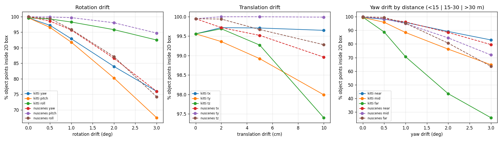
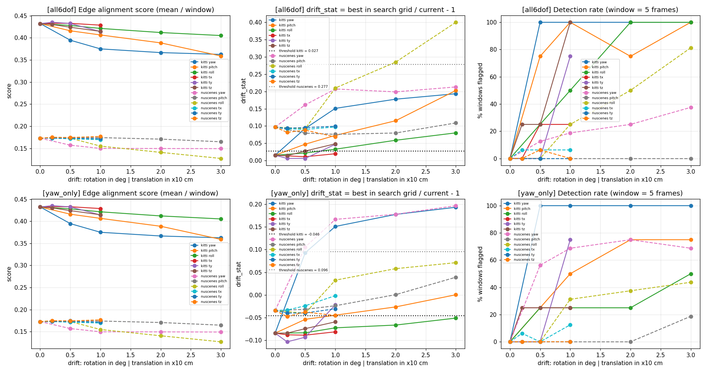
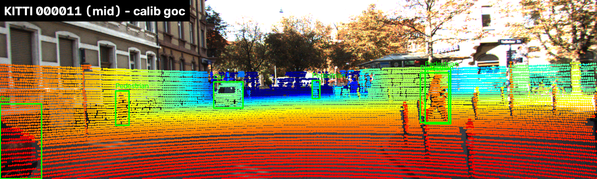
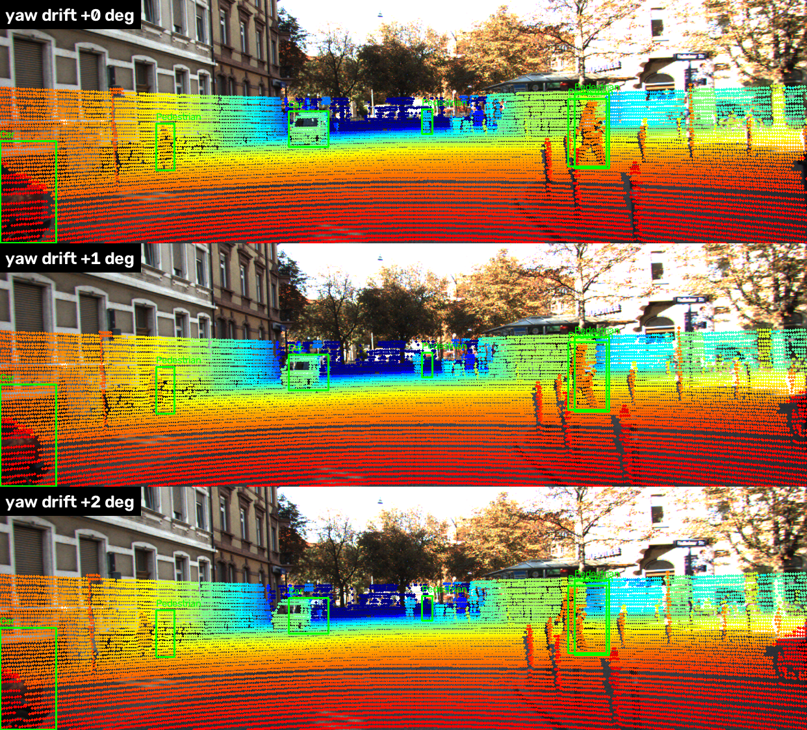
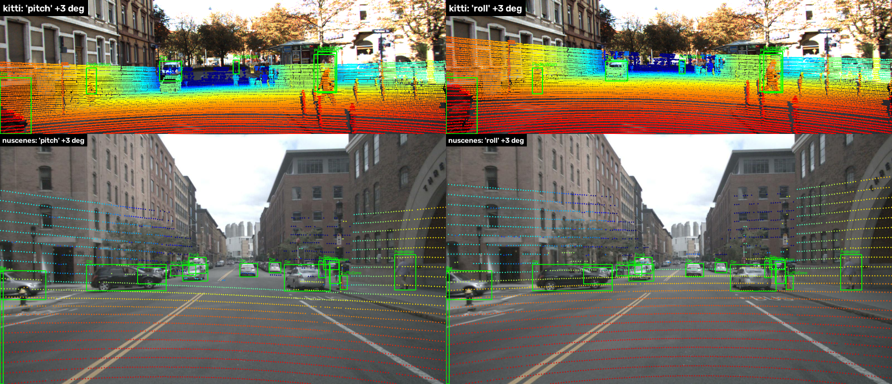
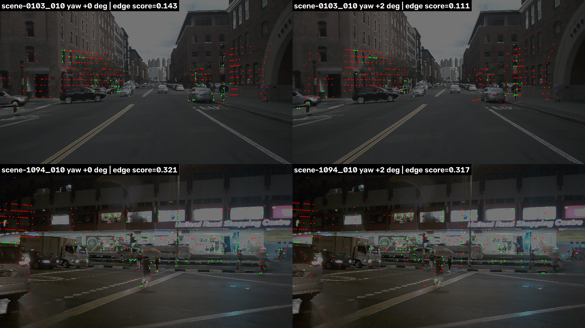
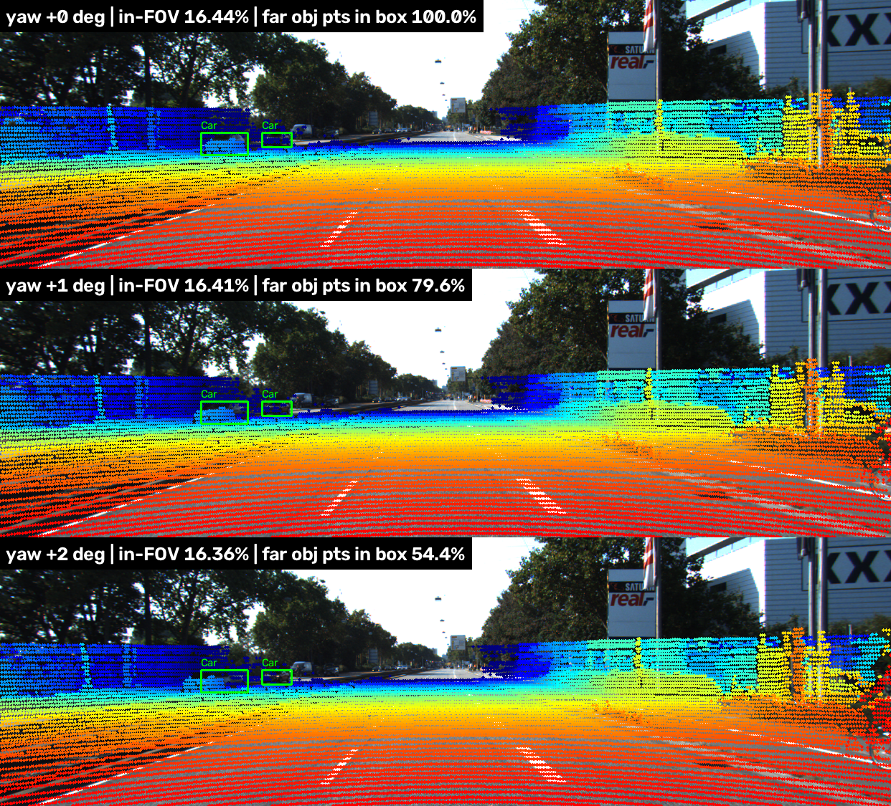

# Báo cáo Day 6: Độ nhạy của LiDAR-camera projection với calibration drift

> Thay **mọi** ô có chữ ĐIỀN nằm trong ngoặc vuông bằng nội dung của bạn, xoá luôn cả dấu ngoặc vuông. Lệnh `python tools/check_submission.py` sẽ báo FAIL nếu còn sót bất kỳ chỗ nào.

- **Họ tên:** Đào Quang Cảnh
- **MSSV:** 2A202602542
- **Lớp:** L3A
- **Link repo:** https://github.com/quangcanh02122005/DaoQuangCanh-2A202602542-Track4-Day21
- **Topic:** A — LiDAR-camera projection QA
- **Dataset:** data/kitti_mini (chính), data/nuscenes_mini_subset (so sánh), data/synthetic (debug)
- **Các frame đã dùng:** toàn bộ 20 frame kitti_mini; 80 keyframe nuScenes (scene-0103_000…039, scene-1094_000…039)

> Hãy viết ngắn: mỗi mục từ 3 đến 8 dòng, ưu tiên số liệu và hình ảnh.

## 1. Claim

**Lệch yaw 1° của LiDAR chỉ làm giảm 6.7 điểm % số điểm object rơi đúng vào 2D box trên toàn KITTI (99.6% → 92.9%), nhưng giảm 29 điểm % với vật xa > 30 m (99.7% → 70.6%). Trong khi đó, % điểm trong FOV gần như không đổi (15.74% → 15.75%), nên không dùng được để báo drift.** Edge-alignment score không cần label phát hiện được yaw ≥ 0.5° ở 4/4 cửa sổ 5 frame trên KITTI. Trên nuScenes ban ngày, nó phát hiện được yaw ≥ 1° ở 8/8 cửa sổ, còn trên cảnh đêm/sau mưa chỉ phát hiện được 3–4/8 cửa sổ.

*(Claim nháp ở CP1 dự đoán "giảm hơn 10% ở 1°". Kết quả chỉ đúng với vật xa, nên claim đã được sửa lại theo số liệu.)*

## 2. Evidence

**Thí nghiệm:** chỉ thay đổi đúng một bậc tự do của extrinsic (`perturb_extrinsic`, xoay/dịch LiDAR trong chính LiDAR frame), giữ nguyên frame, label và ảnh. Có 6 loại drift: yaw/pitch/roll ở các mức 0, 0.5, 1, 2, 3° và tx/ty/tz ở các mức 0, 2, 5, 10 cm. Chạy trên 20 frame KITTI và 80 keyframe nuScenes. Phương pháp tất định (không có random), chạy lại 2 lần cho ra cùng file CSV (đã kiểm bằng `cmp`).

- **pct_in_box:** các điểm thuộc object được xác định bằng calib **đúng** (điểm nằm trong 3D box GT, object có ≥ 10 điểm). Metric là % điểm đó vẫn rơi vào 2D box label khi chiếu bằng calib **lệch**. Chia theo khoảng cách: near < 15 m, mid 15–30 m, far > 30 m. Số object: KITTI 32/40/35, nuScenes 84/173/35.
- **Edge score:** LiDAR depth edges (bước nhảy > 0.5 m dọc theo từng scan line) so với khoảng cách tới cạnh Canny, theo Levinson & Thrun (RSS 2013). Quyết định trên mỗi cửa sổ 5 frame: `drift_stat = max(score trong lưới tìm quanh calib) / score(calib hiện tại) − 1`. Ngưỡng là `drift_stat` lớn nhất khi calib đúng + 0.005.

Bảng chính, trích từ `results/drift_sweep.csv` (đầy đủ cả 6 bậc tự do × 2 dataset) và `results/edge_detection.csv`:

| Drift (KITTI) | % trong FOV | pct_in_box tổng | near | mid | **far** | Edge detector phát hiện (all6dof, 4 cửa sổ) |
|---|---|---|---|---|---|---|
| 0 (calib gốc) | 15.74 | 99.56 | 99.58 | 99.48 | 99.72 | 0/4 (không báo nhầm) |
| yaw 0.5° | 15.75 | 97.20 | 98.17 | 95.93 | 88.77 | 4/4 |
| yaw 1° | 15.75 | 92.87 | 95.81 | 88.42 | **70.63** | 4/4 |
| yaw 2° | 15.75 | 83.96 | 89.18 | 76.20 | 43.46 | 4/4 |
| yaw 3° | 15.76 | 75.95 | 82.97 | 64.76 | 25.83 | 4/4 |
| pitch 1° / 3° | 15.01 / 13.49 | 91.77 / 67.48 | | | 65.47 / 15.27 | 4/4 / 4/4 |
| roll 1° / 3° | 15.74 / 15.77 | 98.25 / 92.47 | | | | 2/4 / 4/4 |
| tx/ty/tz 10 cm | 16.07 / 15.75 / 16.46 | 99.65 / 97.99 / 97.40 | | | | 1/4 / 3/4 / 4/4 |

Nhận xét:
- **Lỗi xoay nguy hiểm hơn lỗi dịch.** Xoay làm điểm lệch một góc cố định, khoảng f·θ ≈ 721 px × 0.0175 ≈ 12.6 px cho mỗi 1°, không phụ thuộc khoảng cách. Vật ở xa chỉ rộng vài chục px nên rơi ra khỏi box. Dịch t làm điểm lệch khoảng f·t/Z, nên 10 cm ở 20 m chỉ lệch ~3.6 px. Ở mức ≤ 10 cm, cả hai metric đều gần như không thấy lỗi dịch.
- **Pitch tệ nhất trên KITTI** vì 2D box của vật xa rất thấp (chiều cao ít px). Roll nhẹ nhất vì vật nằm gần tâm ảnh, nơi xoay quanh trục quang học dịch điểm ít.




**So sánh 2 cấu hình detector (B1), với yaw drift, theo tỉ lệ cửa sổ bị gắn cờ** (`results/edge_detection.csv`):

| Dataset | Lưới tìm kiếm | yaw 0 | 0.5° | 1° | 2° | 3° | Ưu / nhược |
|---|---|---|---|---|---|---|---|
| KITTI | all6dof (yaw/pitch/roll ±0.5…3°, t ±5/10 cm) | 0% | 100% | 100% | 100% | 100% | Phát hiện được cả pitch, tz. Lưới 36 calib quanh calib hiện tại |
| KITTI | yaw_only | 0% | 100% | 100% | 100% | 100% | Rẻ hơn 4 lần nhưng mù với roll/translation |
| nuScenes | all6dof | 0% | 12.5% | 19% | 25% | 37.5% | Ngưỡng bị đẩy lên 0.277 vì báo nhầm theo chiều dọc (xem mục 3) |
| nuScenes | yaw_only | 0% | 56% | 69% | 75% | 69% | Ngưỡng 0.096. Ban ngày (scene-0103) yaw ≥ 1° = 100%, ban đêm (scene-1094) 38–50% |

**Cùng thí nghiệm trên 2 dataset (B5):** nuScenes có % trong FOV thấp hơn KITTI (8.7% so với 15.7%) vì LiDAR quay 360° và CAM_FRONT chỉ thấy khoảng 70°. Nó cũng có ít điểm hơn (32 beam so với 64 beam). Các beam thưa theo chiều dọc (~1.3° giữa hai beam), nên khớp cạnh ràng buộc chiều dọc rất yếu và edge score trung bình thấp hơn (0.17 so với 0.43). Riêng tỉ lệ in-box với yaw 1° thì tương tự (95.7% so với 92.9%). nuScenes ít vật > 30 m có ≥ 10 điểm, và ảnh 1600 px với focal ~1253 px làm 1° ≈ 22 px, nhưng box cũng lớn tương ứng.

**Latency (B3)** (`results/latency.csv`): bỏ lần chạy đầu, đo 30 lần, CPU Intel i7-1255U (laptop, 1 process, không dùng GPU). Chiếu toàn bộ frame KITTI (120k điểm) mất p50 10.0 ms / p95 10.3 ms. nuScenes (35k điểm) mất 1.7 / 1.8 ms. Một lần tính edge score mất < 1 ms, còn tiền xử lý (Canny + LiDAR edges) ~14 ms/frame. Lưới all6dof (36 calib) tốn ~14 + 36×0.6 ≈ 35 ms/frame (KITTI), nên chạy được ở 10 Hz nếu chỉ chạy 1 frame/giây làm health check. Latency dao động theo tải máy, nên con số chạy lại sẽ khác vài %.

**Demo** (calib gốc, 3 khoảng cách, KITTI): `results/figures/demo_near_kitti_000019.png`, `demo_mid_kitti_000011.png`, `demo_far_kitti_000004.png`. Ảnh nuScenes: `demo_nuscenes_scene-0103_010.png`.




## 3. Failure case

**F1: Geometry. "pitch" trên nuScenes thực ra là roll.** `perturb_extrinsic` xoay quanh trục của *chính LiDAR frame*. KITTI có x hướng trước, y sang trái, nhưng nuScenes có x sang phải, y hướng trước. Vì vậy lệnh `pitch=3°` (quanh trục y) trên nuScenes thực chất là roll: ảnh xoay quanh tâm, pct_in_box chỉ giảm 5.2 điểm %. Còn `roll=3°` lại làm đám điểm trượt dọc (pitch thật), pct_in_box giảm 25.7 điểm %, vật xa chỉ còn 28.9%. So với KITTI, kết quả bị đảo hẳn (bảng `drift_sweep.csv`).
Cách phát hiện: luôn ghi `frame_id` và quy ước trục kèm mỗi tham số calib. Unit test bằng điểm (0, 10, 0) trên nuScenes phải có z_cam ≈ 10.



**F2: Metric/Sensor. Edge score không phát hiện yaw 2° trên cảnh đêm sau mưa.** Với nuScenes scene-1094_010, score khi calib đúng là 0.321 và khi lệch yaw 2° là 0.317, gần như bằng nhau. Ảnh đêm có rất nhiều cạnh Canny từ biển hiệu, đèn và vệt phản chiếu trên đường ướt, nên dịch đám điểm đi đâu cũng gặp một cạnh. Cùng lúc đó, cảnh ban ngày scene-0103_010 giảm từ 0.143 xuống 0.111. Kết quả là ở cảnh đêm chỉ 3–4/8 cửa sổ được gắn cờ, so với 8/8 ban ngày. Ngoài ra trên nuScenes, nhiều cửa sổ *calib đúng* vẫn chọn roll ±2–3° (tức pitch thật) vì 32 beam thưa theo chiều dọc. Điều này đẩy ngưỡng all6dof lên 0.277.
Cách khắc phục: chỉ chạy kiểm tra khi ảnh đủ sáng và mật độ cạnh vừa phải (ghi log `edge_density` và độ sáng), lọc cạnh theo gradient mạnh, tích luỹ nhiều frame hơn ban đêm. Hoặc dùng metric khác như intensity–gray mutual information.



**F3: Metric. % điểm trong FOV không thấy drift.** Với KITTI 000004 lệch yaw 0 → 1 → 2°, % trong FOV vẫn là 16.44 → 16.41 → 16.36%, trong khi điểm của xe xa trong box giảm 100 → 79.6 → 54.4%. Lý do: đám mây điểm chỉ "trượt ngang", điểm ra khỏi mép ảnh bên này được bù bởi điểm vào ở mép kia. Không nên dùng % FOV làm health metric cho calibration.



**F4: Time. Bỏ bù ego-motion** (`results/time_sync_ego_motion.csv`). LiDAR và camera của nuScenes lệch nhau trung bình 35 ms. Nếu coi hai sensor chụp cùng lúc, pct_in_box giảm 99.90 → 95.90% (scene-0103) và 99.99 → 98.68% (scene-1094). Mức này tương đương drift yaw ~1°, tức lỗi thời gian có thể bị nhầm thành lỗi calibration. Cần ghi log `t_cam − t_lidar` cho từng frame.

## 4. Khuyến nghị nếu triển khai thật

- **Use-case:** ADAS dùng fusion LiDAR–camera, ví dụ gán màu/class cho điểm LiDAR, hoặc kiểm tra chéo detector camera. Câu hỏi thuyết trình: *bracket lệch 1° sau va chạm nhẹ có tự phát hiện được không?* Có, nếu là yaw/pitch và có ánh sáng tốt. Edge detector bắt được drift sau một cửa sổ 5 frame (KITTI 4/4, nuScenes ban ngày 8/8). Ảnh hưởng thấy rõ nhất ở **vật xa > 30 m**, vì tại đó 1° làm mất ~30% điểm trên object. Gần hơn 15 m chỉ mất ~4%.
- **Trade-off:**
  - Lưới all6dof bắt được nhiều kiểu lỗi hơn nhưng tốn ~35 ms/frame và báo nhầm nhiều trên LiDAR 32 beam. yaw_only rẻ hơn và ổn định hơn nhưng mù với roll/translation.
  - Cửa sổ dài hơn giảm báo nhầm nhưng phát hiện chậm hơn.
  - Lỗi dịch ≤ 10 cm hầu như không thể phát hiện, và cũng gần như vô hại cho fusion ở tầm > 10 m.
- **Chỉ số cần log khi chạy thật:** `edge_score` và `drift_stat` theo cửa sổ, kèm calib tốt nhất trong lưới; `edge_density` và độ sáng ảnh (để biết kết quả có đáng tin không); `t_cam − t_lidar`; % điểm LiDAR rơi vào box của detector camera, chia theo khoảng cách; phiên bản calib và quy ước trục.
- **Hành động:** nếu `drift_stat` vượt ngưỡng ở ≥ N cửa sổ liên tiếp *ban ngày*, giảm trọng số fusion cho vật xa và lên lịch hiệu chỉnh lại. Ngưỡng ở đây được chọn trên cùng dữ liệu, nên phải hiệu chỉnh lại trên một tập log riêng.

## 5. Cách chạy lại

```bash
python -m venv .venv && source .venv/bin/activate
pip install -r requirements.txt

# CP2: kiểm tra projection
python -m starter.projection --data-root data/synthetic --frame 000000
python -m starter.projection --data-root data/kitti_mini --frame 000011
python -m starter.projection --data-root data/nuscenes_mini_subset --frame scene-0103_010

# Toàn bộ thí nghiệm (~1.5 phút CPU). Xem tham số: python -m src.calib_qa --help
python -m src.calib_qa demo      # results/figures/demo_*.png
python -m src.calib_qa sweep     # results/drift_sweep.csv, drift_sweep_frames.csv, figures/drift_sweep.png
python -m src.calib_qa edge      # results/edge_detection.csv, edge_score_windows.csv, figures/edge_score_vs_drift.png
python -m src.calib_qa fail      # results/figures/fail_0*.png, results/time_sync_ego_motion.csv
python -m src.calib_qa latency   # results/latency.csv
# hoặc: python -m src.calib_qa all
```

Code: `src/calib_metrics.py` (metric: điểm trong 3D box, in-box hits, LiDAR depth edges, edge score) và `src/calib_qa.py` (CLI có `--help`, dùng lại được cho bài sau qua các tham số `--datasets`, `--kinds`, `--window`, `--runs`, `--out-dir`).

## 6. Khai báo sử dụng AI

| Công cụ | Dùng cho việc gì | Bạn đã kiểm chứng thế nào |
|---|---|---|
| Claude Code (Claude Opus) | Đọc đề, viết 2 hàm TODO trong `starter/projection.py`, viết `src/calib_metrics.py` và `src/calib_qa.py` (sweep, edge score, vẽ biểu đồ), soạn nháp REPORT | Test tay điểm (10, 0, 0) → z_cam = 9.727, (u, v) = (613.96, 175.01) như CHECKPOINTS; điểm NaN và điểm sau camera bị loại; nhìn overlay trên 3 dataset; chạy lại sweep/edge 2 lần ra CSV giống hệt (`cmp`); xem từng ảnh fail để đối chiếu với số liệu; tự giải thích được công thức f·θ và f·t/Z ở mục 2 |
